# Database Locking Strategies Demo

**Understanding Concurrency Control in Enterprise Applications**


## Overview

A Spring Boot application that demonstrates various database locking strategies through practical examples. This project serves as a comprehensive guide for understanding when and how to implement different locking mechanisms in concurrent applications.

## Architecture

```mermaid
flowchart TB
    subgraph Client["👥 Concurrent Users"]
        User1["User 1"]
        User2["User 2"]
    end

    subgraph API["⚡ REST API"]
        TicketController["Ticket Controller<br/>/api/tickets"]
        InventoryController["Inventory Controller<br/>/api/inventory"]
    end

    subgraph Service["🔧 Service Layer"]
        TicketService["Ticket Service<br/>Pessimistic Locking"]
        InventoryService["Inventory Service<br/>Optimistic Locking"]
    end

    subgraph Repository["📦 Repository Layer"]
        TicketRepo["Ticket Repository<br/>@Lock(PESSIMISTIC_WRITE)"]
        InventoryRepo["Inventory Repository<br/>@Version field"]
    end

    subgraph Database["💾 H2 / MySQL"]
        TicketTable["Ticket Table<br/>Row-Level Lock"]
        InventoryTable["Inventory Table<br/>Version Column"]
    end

    User1 --> TicketController
    User2 --> TicketController
    User1 --> InventoryController
    User2 --> InventoryController

    TicketController --> TicketService
    InventoryController --> InventoryService

    TicketService --> TicketRepo
    InventoryService --> InventoryRepo

    TicketRepo -->|"SELECT FOR UPDATE"| TicketTable
    InventoryRepo -->|"WHERE version = ?"| InventoryTable

    style Client fill:#e3f2fd,stroke:#1976d2
    style API fill:#fff3e0,stroke:#f57c00
    style Service fill:#e8f5e9,stroke:#388e3c
    style Repository fill:#fce4ec,stroke:#c2185b
    style Database fill:#f3e5f5,stroke:#7b1fa2
```



## Locking Strategies

```mermaid
flowchart LR
    subgraph Pessimistic["🔒 Pessimistic Locking"]
        P1["1. Acquire Lock"] --> P2["2. Read Data"]
        P2 --> P3["3. Modify Data"]
        P3 --> P4["4. Release Lock"]
        P5["Other Transactions<br/>WAIT"]
    end

    subgraph Optimistic["✨ Optimistic Locking"]
        O1["1. Read Data + Version"] --> O2["2. Modify Data"]
        O2 --> O3["3. Update WHERE version=X"]
        O3 --> O4{Version Match?}
        O4 -->|Yes| O5["4. Success"]
        O4 -->|No| O6["4. Retry/Fail"]
    end

    style Pessimistic fill:#ffebee,stroke:#c62828
    style Optimistic fill:#e8f5e9,stroke:#2e7d32
```



## Key Features

| Feature | Description |
|---------|-------------|
| **Pessimistic Locking** | Row-level locks with `@Lock(PESSIMISTIC_WRITE)` |
| **Optimistic Locking** | Version-based concurrency with `@Version` annotation |
| **Ticket Booking Demo** | High-contention scenario with pessimistic locks |
| **Inventory Management** | Low-contention scenario with optimistic locks |
| **Concurrent Testing** | Built-in tests for race condition scenarios |
| **H2 Console** | In-memory database with web console |

## When to Use Each Strategy

| Aspect | Pessimistic Locking | Optimistic Locking |
|--------|-------------------|-------------------|
| **Performance** | Lower (locking overhead) | Higher (no locks during reads) |
| **Concurrency** | Lower (blocks transactions) | Higher (concurrent reads) |
| **Best for** | High contention, critical ops | Low contention, read-heavy |
| **Failure handling** | Prevents conflicts | Requires retry logic |
| **Use cases** | Banking, ticket booking | Inventory, user profiles |

This project showcases two primary database locking strategies:

1. **Pessimistic Locking** - Lock first, then access (demonstrated with ticket booking)
2. **Optimistic Locking** - Access first, validate on update (demonstrated with inventory management)

## 🚀 Quick Start

### Prerequisites
- Java 21+
- Maven 3.6+

### Running the Application

```bash
# Clone the repository
git clone https://github.com/rajeswarandhandapani/db-locking-strategies.git
cd db-locking-strategies

# Run with Maven
./mvnw spring-boot:run

# Or if mvnw is not available
mvn spring-boot:run
```

The application will start on `http://localhost:8080`

### Sample Data
The application automatically initializes with sample data:
- 3 tickets (IDs: 1, 2, 3) - for pessimistic locking demos
- 3 inventory items (IDs: 1, 2, 3) - for optimistic locking demos

## 📋 API Endpoints

### Pessimistic Locking - Ticket Booking System

| Method | Endpoint | Description |
|--------|----------|-------------|
| GET | `/api/tickets` | List all tickets |
| POST | `/api/tickets` | Create a new ticket |
| GET | `/api/tickets/{id}` | Get ticket details |
| POST | `/api/tickets/{id}/book` | Book a ticket (uses pessimistic locking) |
| POST | `/api/tickets/{id}/cancel` | Cancel ticket booking |

### Optimistic Locking - Inventory Management

| Method | Endpoint | Description |
|--------|----------|-------------|
| GET | `/api/inventory` | List all inventory items |
| POST | `/api/inventory` | Create a new inventory item |
| GET | `/api/inventory/{id}` | Get inventory item details |
| PUT | `/api/inventory/{id}/update-quantity?newQuantity=X` | Update quantity (uses optimistic locking) |
| POST | `/api/inventory/{id}/reduce?amount=X` | Reduce quantity (purchase simulation) |

## 🔍 Locking Strategies Explained

### 1. Pessimistic Locking 🔒

**When to use:**
- High contention scenarios where conflicts are likely
- When the cost of retrying is high
- Critical operations that cannot afford conflicts (e.g., financial transactions, ticket booking)

**How it works:**
- Acquires a lock on the database row before reading
- Other transactions must wait until the lock is released
- Guarantees no conflicts but may impact performance

**Example - Ticket Booking:**
```bash
# Scenario: Two users trying to book the same ticket simultaneously

# User 1: Book ticket 1
curl -X POST http://localhost:8080/api/tickets/1/book

# User 2: Tries to book the same ticket (will wait until User 1's transaction completes)
curl -X POST http://localhost:8080/api/tickets/1/book
```

**Implementation Details:**
```java
@Lock(LockModeType.PESSIMISTIC_WRITE)
@Query("SELECT t FROM Ticket t WHERE t.id = :id")
Optional<Ticket> findByIdWithPessimisticLock(@Param("id") Long id);
```

### 2. Optimistic Locking ✨

**When to use:**
- Low contention scenarios where conflicts are rare
- Read-heavy applications
- When you want better performance and can handle occasional retries

**How it works:**
- No locks during read operations
- Uses version numbers to detect conflicts during updates
- If version has changed, throws `OptimisticLockException`

**Example - Inventory Update:**
```bash
# Scenario: Two users trying to update the same inventory item

# Check current inventory
curl http://localhost:8080/api/inventory/1

# User 1: Update quantity to 50
curl -X PUT "http://localhost:8080/api/inventory/1/update-quantity?newQuantity=50"

# User 2: Tries to update based on old version (will fail with OptimisticLockException)
curl -X PUT "http://localhost:8080/api/inventory/1/update-quantity?newQuantity=30"
```

**Implementation Details:**
```java
@Entity
public class InventoryItem {
    @Version
    private Long version;  // Automatically managed by JPA
    // other fields...
}
```

## 🧪 Testing Concurrent Scenarios

### Test Pessimistic Locking
```bash
# Terminal 1: Start booking ticket 1
curl -X POST http://localhost:8080/api/tickets/1/book

# Terminal 2: Immediately try booking the same ticket
curl -X POST http://localhost:8080/api/tickets/1/book
# This will wait until the first transaction completes
```

### Test Optimistic Locking
```bash
# Get current state
curl http://localhost:8080/api/inventory/1

# Terminal 1: Update quantity
curl -X PUT "http://localhost:8080/api/inventory/1/update-quantity?newQuantity=100" &

# Terminal 2: Immediately update with different value
curl -X PUT "http://localhost:8080/api/inventory/1/update-quantity?newQuantity=200" &
# One will succeed, the other will fail with OptimisticLockException
```

## 📊 Comparison Table

| Aspect | Pessimistic Locking | Optimistic Locking |
|--------|-------------------|-------------------|
| **Performance** | Lower (due to locking overhead) | Higher (no locks during reads) |
| **Concurrency** | Lower (blocks other transactions) | Higher (allows concurrent reads) |
| **Best for** | High contention, critical operations | Low contention, read-heavy workloads |
| **Failure handling** | Prevents conflicts | Requires retry logic |
| **Use cases** | Banking, ticket booking, reservations | Inventory, user profiles, catalogs |

## 🏗️ Architecture & Flow

### Pessimistic Locking Flow
```
Request → Controller → Service → Repository (acquire lock) → Database
                                      ↓
Response ← Controller ← Service ← Repository (release lock) ← Database
```

### Optimistic Locking Flow
```
Request → Controller → Service → Repository → Database (read with version)
                                      ↓
Response ← Controller ← Service ← Repository ← Database (update if version matches)
                                      ↓
                                 Version conflict? → OptimisticLockException
```

## 🛠️ Technology Stack

- **Spring Boot 3.5.4** - Application framework
- **Spring Data JPA** - Data persistence
- **H2 Database** - In-memory database for demos
- **Maven** - Dependency management
- **JUnit 5** - Testing framework

## 📁 Project Structure

```
src/
├── main/java/com/rajeswarandhandapani/dblocking/
│   ├── controller/          # REST controllers
│   │   ├── TicketController.java      # Pessimistic locking demos
│   │   └── InventoryController.java   # Optimistic locking demos
│   ├── service/             # Business logic
│   ├── repository/          # Data access layer
│   ├── model/              # JPA entities
│   └── config/             # Configuration classes
└── test/java/              # Test cases
    ├── OptimisticLockingTest.java
    └── PessimisticLockingTest.java
```

## 🧪 Running Tests

```bash
# Run all tests
./mvnw test

# Run specific test class
./mvnw test -Dtest=OptimisticLockingTest
./mvnw test -Dtest=PessimisticLockingTest
```

## 🔧 Configuration

### Database Configuration
The application uses H2 in-memory database by default. You can access the H2 console at:
- URL: `http://localhost:8080/h2-console`
- JDBC URL: `jdbc:h2:mem:testdb`
- Username: `sa`
- Password: (empty)

### Switching to MySQL (Optional)
Add MySQL dependency to `pom.xml` and update `application.yaml`:

```yaml
spring:
  datasource:
    url: jdbc:mysql://localhost:3306/locking_demo
    username: your_username
    password: your_password
    driver-class-name: com.mysql.cj.jdbc.Driver
  jpa:
    database-platform: org.hibernate.dialect.MySQL8Dialect
```

## 🤝 Contributing

1. Fork the repository
2. Create a feature branch (`git checkout -b feature/amazing-feature`)
3. Commit your changes (`git commit -m 'Add some amazing feature'`)
4. Push to the branch (`git push origin feature/amazing-feature`)
5. Open a Pull Request

## 📝 License

This project is licensed under the MIT License - see the [LICENSE](LICENSE) file for details.

## 🎓 Learning Resources

- [JPA Locking](https://docs.oracle.com/javaee/7/tutorial/persistence-locking.htm)
- [Spring Data JPA Reference](https://docs.spring.io/spring-data/jpa/docs/current/reference/html/)
- [Database Concurrency Control](https://en.wikipedia.org/wiki/Concurrency_control)

---
